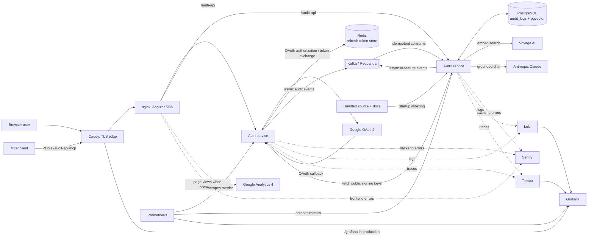

# ask-app

This README combines the project overview with the code-verified runtime
architecture. It is intentionally focused on how the deployed system is
connected and why its boundaries exist.

Source: <a href="https://github.com/sahilparekh1212/ask-app" target="_blank" rel="noopener noreferrer">github.com/sahilparekh1212/ask-app</a>

## What this project is

ask-app is a production-shaped full-stack portfolio application:

- Angular 21 single-page application served by nginx;
- Spring Boot Auth and Audit services;
- Google OAuth2, RSA-signed JWTs, JWKS, and role-based access control;
- asynchronous audit events through Kafka/Redpanda;
- PostgreSQL and pgvector for audit data and repository RAG;
- a server-side Claude assistant and public MCP knowledge-search endpoint;
- Prometheus, Loki, Tempo, Grafana, Google Analytics 4, and Sentry; and
- Docker/OpenShift deployment definitions plus CI/CD and supply-chain checks.

The live app is available at
<a href="https://ask-app.sahilparekh1212.com" target="_blank" rel="noopener noreferrer">ask-app.sahilparekh1212.com</a>. The demo
account is `demo` / `demo`.

## System diagram



## Core runtime flows

### Authentication and authorization

The SPA calls Auth through nginx's same-origin `/auth-api` proxy. Auth supports
the demo login and Google OAuth2, issues RSA-signed access JWTs, and exposes a
JWKS endpoint. Audit retrieves the public JWKS to verify tokens locally; it
never receives Auth's private signing key and does not call Auth for each API
request.

Refresh tokens are single-use and stored with a TTL in Redis. The browser keeps
the access and refresh tokens locally; its HTTP interceptor attaches the bearer
token and performs one refresh-and-retry after a `401`.

### Event-driven audit trail

Auth publishes login, refresh, and logout `AuditEvent`s asynchronously to the
`audit.events` Kafka topic. Audit also publishes its own chat, RAG, and MCP
activity to that same topic. The Audit consumer processes messages
transactionally, deduplicates at-least-once delivery by `eventId`, and persists
audit rows in PostgreSQL. A slow broker does not block the original feature or
authentication request; missed events during an outage are an accepted
fire-and-forget trade-off.

### Assistant, RAG, and MCP

The UI sends chat requests only to Audit, keeping provider credentials outside
the browser. Audit screens prompts for credentials and PII before any external
call. It embeds a question with Voyage, searches pgvector for repository
chunks, builds a role-scoped prompt, and submits only readable retrieved text to
Claude. Vectors never reach Claude.

At startup, Audit incrementally indexes bundled documentation and source code:
new or changed chunks are embedded with Voyage and stored in pgvector. The same
RAG service powers `/mcp`; it exposes repository knowledge only and does not
expose audit rows.

## Component map

| Area | Responsibility | Main location |
|---|---|---|
| UI | Angular routes, auth state, dashboard, chat, GA4 and Sentry | `UI/src/app/` |
| Edge | TLS, SPA hosting, same-origin proxying, production Grafana route | `Backend/deploy/Caddyfile`, `UI/nginx.conf` |
| Auth | OAuth/demo login, JWT/JWKS, refresh token lifecycle, event producer | `Backend/Auth/` |
| Audit | Audit APIs, Kafka consumer, RAG, chat, MCP | `Backend/Audit/` |
| Shared library | `AuditEvent` contract and per-instance request limiter | `Backend/common/` |
| Data | Audit records, RAG vectors, refresh tokens, event log | PostgreSQL/pgvector, Redis, Kafka |
| Observability | Metrics, logs, traces, dashboards | `Backend/monitoring/` |

## State, scaling, and resilience

| Component | State model |
|---|---|
| UI/nginx, Auth, Audit | Stateless compute: services can be replicated |
| Redis | Shared single-use refresh-token state |
| Kafka/Redpanda | Durable audit-event log and dead-letter flow |
| PostgreSQL + pgvector | Durable audit records and vector index |
| Prometheus, Loki, Tempo | Persistent telemetry stores |
| Grafana | Config-as-code dashboards and datasources; anonymous read-only viewing |
| RAG index | Stateful but reconstructible from the corpus bundled into the Audit image |

The `common` module's newest-wins limiter is a deliberate exception: it tracks
the active Java worker thread for each `userId + method + path` key, so it must
stay local to each service instance. It is request deduplication, not a shared
rate counter; a superseded request is interrupted and returns `429` with
`Retry-After`. Audit mutations use a transactional checkpoint so an interrupted,
superseded request rolls back rather than leaving partial writes.

## Observability and external reporting

- Prometheus polls the Spring services' metrics endpoints.
- Services send structured logs to Loki and OpenTelemetry traces to Tempo.
- Grafana reads all three sources and is served at `/grafana` in production.
- The Angular SPA reports route-level page views to GA4 only when a measurement
  ID is configured.
- UI, Auth, and Audit send errors to Sentry only when their DSNs are configured;
  performance tracing remains with Tempo.

## Run locally

```bash
cd Backend
docker compose up --build
```

This starts the SPA at `http://localhost:4200`, Auth on port `8085`, Audit on
port `8083`, PostgreSQL, Redis, Redpanda, and the observability stack. Chat and
RAG are optional: export `ANTHROPIC_API_KEY` and `VOYAGE_API_KEY` to enable
them; the rest of the system remains usable without either key.

## Further reading

- <a href="https://github.com/sahilparekh1212/ask-app/blob/main/Backend/README.md" target="_blank" rel="noopener noreferrer">Backend guide</a>
- <a href="https://github.com/sahilparekh1212/ask-app/blob/main/Backend/docs/adr/README.md" target="_blank" rel="noopener noreferrer">Architecture decisions</a>
- <a href="https://github.com/sahilparekh1212/ask-app/blob/main/Backend/docs/deployment.md" target="_blank" rel="noopener noreferrer">Deployment guide</a>

## License

**Proprietary — all rights reserved.** This repository is published for
viewing/portfolio evaluation only; no right to use, run, copy, modify, or
distribute the code is granted. See
<a href="https://github.com/sahilparekh1212/ask-app/blob/main/LICENSE" target="_blank" rel="noopener noreferrer">LICENSE</a>.
